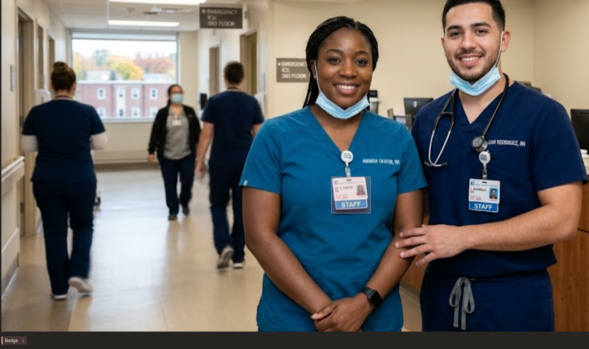
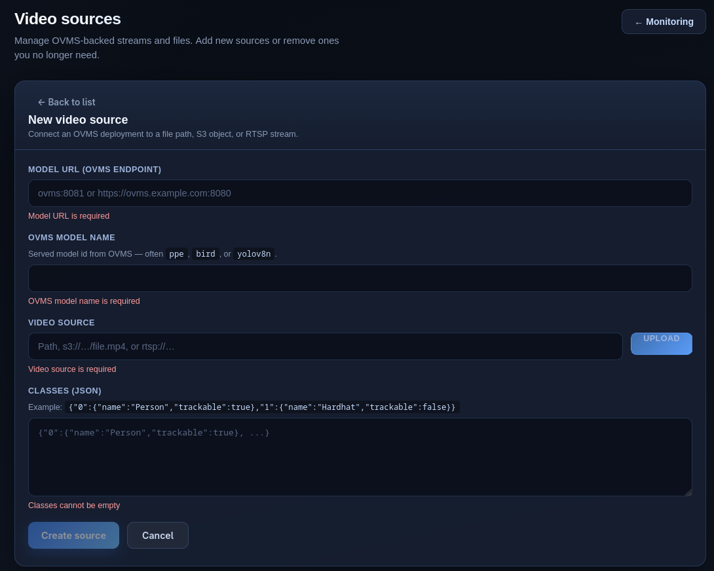
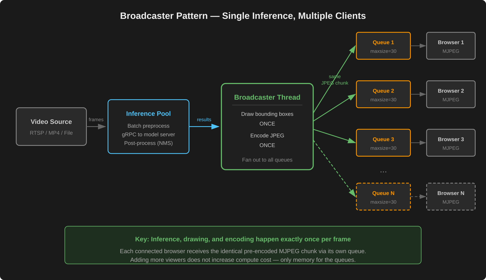
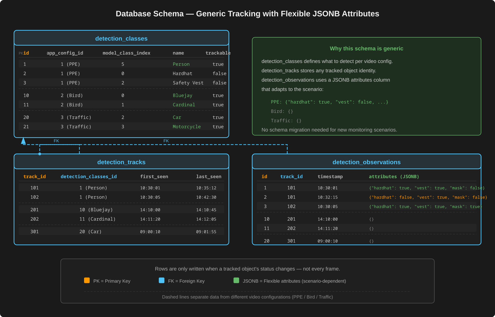
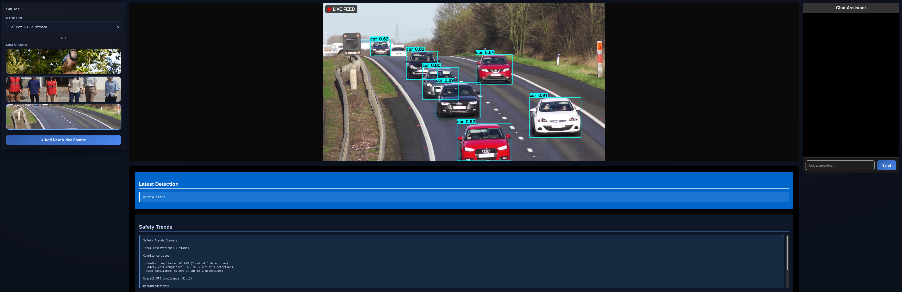
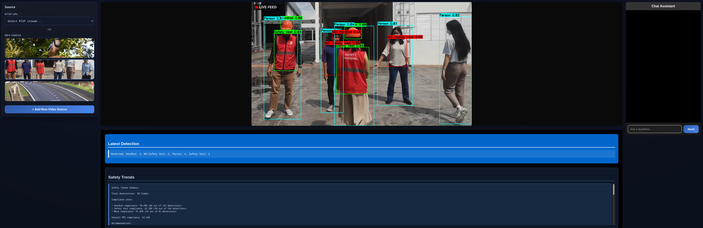

# Building an AI-Powered Multimodal Compliance Monitor: From Training to Tracking to Chat

Organizations face a persistent challenge maintaining workplace safety and operational compliance across facilities with multiple video feeds. Manual monitoring is resource-intensive, inherently reactive, and often misses critical events or patterns that indicate safety risks. A single safety officer watching a bank of screens cannot reliably track whether every worker on a busy factory floor is wearing their hardhat, vest, and mask — let alone recall compliance trends from last week.

This project tackles that problem with a complete, end-to-end AI monitoring system that combines computer vision and large language models (LLMs) into a single platform. It goes beyond simple object detection: it helps train custom models, serves them in real time, tracks people and equipment across video frames, persists relevant data to a database, and lets users query it all through natural-language chat. The underlying database schema is deliberately generic — it stores tracks and observations with flexible JSONB attributes rather scenario specific database columns — so the same application can capture details about any monitoring scenario (wildlife, traffic, warehouse operations) without any changes to the application. Built as a quickstart for Red Hat OpenShift AI, it demonstrates how these capabilities come together in a production-grade application which can be used in many monitoring situations.

What follows is a walkthrough of the entire workflow — from labeling images and training a model, through real-time detection and tracking, to conversational analytics and a live dashboard.

## Training a custom detection model

The system uses YOLOv8, a state-of-the-art object detection architecture. Out of the box, YOLOv8 is pretrained on the COCO dataset and can already recognize 80 common object classes — people, cars, animals, and everyday items. For many general monitoring scenarios, this pretrained model works immediately with no additional training. However, when a deployment needs to detect domain-specific objects that fall outside COCO's vocabulary — such as hardhats, safety vests, masks, and their absence — the model must be fine-tuned on new labeled images through transfer learning.

Labeling those images is supported through an integrated [Label Studio](https://labelstud.io/) instance, accessible via its own OpenShift route, which provides a browser-based annotation interface backed by the same PostgreSQL and MinIO storage stack as the rest of the application. For teams looking to accelerate annotation, the training pipeline includes optional AI-assisted labeling powered by Grounding DINO, which can generate initial bounding boxes automatically for human review and refinement. 

The image below shows an example of this process in Label Studio: a bounding box has been drawn around a staff identification badge worn by a nurse, teaching the model to recognize badges in a hospital setting.

For detailed steps on how to annotate and label images, see the training [README](https://github.com/rh-ai-quickstart/multimodal-compliance-monitor/blob/main/training/README.md).

The project includes a Jupyter notebook that walks through the training process step by step: installing dependencies, organizing the dataset, generating the training configuration, and running YOLOv8 transfer learning. The output is a trained weights file ready for deployment. For teams looking to automate this further, a Kubeflow pipeline approach — chaining together components from auto-annotation through training, validation, and conditional deployment — is a natural next step on OpenShift AI, though it is not demonstrated in this project.

## From trained model to serving endpoint

Once a model is trained, it needs to be served at low latency for real-time video processing. The system supports two model-serving runtimes, selected based on the available hardware.

For CPU-oriented deployments, it uses OpenVINO Model Server (OVMS). The trained PyTorch weights are automatically exported to OpenVINO's optimized intermediate representation format by a preparation container that runs before the model server starts. For GPU-capable deployments, the system uses KServe with NVIDIA's Triton Inference Server, following the standard open inference protocol.

Both runtimes communicate with the backend over gRPC for fast, low-overhead inference calls. A runtime abstraction layer in the backend dynamically selects the appropriate client at startup, so the rest of the application is agnostic to which serving infrastructure is running underneath.

A single deployment can serve multiple models simultaneously. The included demo configurations showcase this: PPE detection with ten classes, bird species identification, and general traffic monitoring using a pretrained model — all served from the same infrastructure, seamlessly switchable at runtime.

Adding a new video source is done through the application's configuration page. Users provide the model server URL (the OVMS or KServe endpoint), a model name (e.g., `ppe`, `bird`, or `yolov8n`), a video source (a local file path, S3 object URL, or RTSP stream), and a JSON class definition that maps the model's numeric class indices to human-readable names and specifies which classes should be tracked. An upload button allows video files to be pushed directly to MinIO storage from the browser.

## Real-time video processing and object detection

With a model being served, the system is ready to process live video. It ingests frames from multiple source types: live RTSP camera streams, MP4 files stored in MinIO (the system's S3-compatible object storage), or local video files. RTSP streams include automatic reconnection logic; file-based sources loop continuously and throttle to their native frame rate.

The inference pipeline is designed for throughput. A pool of worker threads preprocesses incoming frames and batches them into a single tensor for each inference call, reducing the overhead of individual gRPC round trips. After inference, the raw model output goes through standard post-processing — non-maximum suppression to eliminate duplicate detections, coordinate conversion to map results back to original frame dimensions, and confidence thresholding to filter out low-quality predictions.

A key architectural decision is the broadcaster pattern for multi-client streaming. Regardless of how many browser clients are connected, the system runs inference exactly once per frame. Bounding boxes are drawn and the frame is JPEG-encoded a single time, then the result is fanned out to all connected client queues. This avoids the cost of duplicating expensive compute for each viewer.

## Multi-object tracking and PPE association

Detection alone tells you what is in a single frame. Tracking tells you what is happening over time. The system uses BoostTrack++, a multi-object tracking algorithm, running in a dedicated operating system process (not just a thread) to isolate its compute from the rest of the pipeline.

The tracker maintains persistent identities for people and objects across frames. But tracking alone is not enough for compliance monitoring — the system also needs to know which PPE items belong to which person. It solves this through a spatial association step: for each tracked person, it computes which hardhats, vests, and masks overlap with that person's bounding box, using efficient vectorized operations. The result is a per-person compliance status updated every frame.

To avoid flooding the database with redundant data, the system implements state-change detection. It only records a new observation when a worker's PPE status actually changes — for example, when someone removes their hardhat or puts on a vest. These tracks and observations are written to PostgreSQL in batched transactions, building up a rich historical record that the conversational AI layer can query.

The diagram below shows how the schema handles three completely different monitoring scenarios — PPE compliance, bird watching, and traffic monitoring — without any structural changes. The `detection_classes` table defines what each model detects, `detection_tracks` stores tracked object identities, and `detection_observations` captures per-track state using a flexible JSONB `attributes` column that carries PPE status for workers or remains empty for simpler scenarios like bird or vehicle counting.

## Conversational AI: chat and natural-language alerts

This is where the system becomes truly multimodal. Rather than requiring users to write SQL queries or navigate dashboards to understand compliance trends, it provides a natural-language chat interface powered by a LangGraph state machine.

The chat pipeline begins with a clarifier that rewrites ambiguous follow-up questions into standalone queries using conversation history. It then routes each question through an intelligent classifier that determines whether the user is asking about what is happening right now or about historical data.

Present-tense questions — "How many people are on the floor?" or "Is everyone wearing their hardhat?" — are answered directly from the live detection context, using what the camera currently sees. Historical questions — "How many workers were missing hardhats yesterday?" or "What was the average vest compliance last week?" — are routed through a different path entirely. A SQL planner decomposes the question into the specific metrics needed, a SQL agent generates and executes queries against the tracking database, and a final synthesis step turns the raw query results into a human-readable answer.

The database access layer uses the Model Context Protocol (MCP) to connect to a read-only PostgreSQL tool server. An application-level security guard ensures that every generated SQL query is scoped to the active video configuration, preventing cross-tenant data leakage through LLM-generated queries.

Beyond chat, the system also supports natural-language alerts. Users can type alert rules in plain English — "Alert me if more than three people are without hardhats in the last hour" — and the system converts them into SQL queries that execute periodically against the live tracking data. Alert results are displayed in the dashboard with severity levels, and the rules can be edited or deleted at any time.

## The dashboard: bringing it all together

The React-based frontend ties the entire workflow into a single interface. It uses a three-panel layout: a source selector on the left with video thumbnails, the live video feed with detection overlays in the center, and a chat assistant on the right.

The center panel shows the MJPEG video stream with real-time bounding boxes drawn around detected objects, along with detection counts and automated safety compliance summaries that update continuously. The chat panel supports full Markdown rendering, making it easy to display structured answers to complex historical queries.

Here is the dashboard running a traffic monitoring video. The model detects and tracks cars on a busy road, drawing bounding boxes with confidence scores around each vehicle. The source selector on the left shows the available video feeds — users can switch between them with a single click.

Switching to a PPE compliance video, the same dashboard now detects people, hardhats, safety vests, and their absence. The "Latest Detection" panel below the video shows real-time counts (e.g., "Hardhat: 3, NO-Safety Vest: 2, Person: 4"), while the "Safety Trends" section displays rolling compliance rates — all generated automatically from the tracking data without any configuration changes.

Multiple browser tabs or clients stay synchronized through Server-Sent Events (SSE). When one user switches the active video source, all connected clients update automatically. A dedicated configuration page provides full management of video sources, detection class definitions, and alert rules, including the ability to upload new video files directly to MinIO storage.

## Running on CPU — no GPU required

The entire application has been optimized to run on CPU hardware. The default model-serving runtime, OpenVINO Model Server, is specifically designed for CPU inference and delivers the performance needed for real-time video processing without any GPU. This makes the system accessible to teams that do not have GPU infrastructure available, and keeps deployment costs low.

For smaller-scale deployments — monitoring anywhere from one to around thirty video feeds — CPU-based inference is more than sufficient. The combination of OpenVINO's optimized model execution, batched inference calls, and efficient frame processing keeps latency well within real-time requirements at this scale. For organizations that need to scale beyond that, the system also supports KServe with NVIDIA Triton Inference Server for GPU-accelerated inference, but a GPU is a scaling choice, not a prerequisite.

## Deployment options

The system is designed to run at multiple scales. For local development and demos, a Podman Compose configuration brings up the full stack — twelve containerized services including MinIO, PostgreSQL, the MCP server, a media relay for RTSP, model preparation, model serving, the backend, the frontend, and optional components like Label Studio and Arize Phoenix for LLM tracing.

For production, a Helm chart deploys the same application on Kubernetes or OpenShift with support for routes, network policies, security context constraints, and persistent volume claims. Init containers handle the workflow of uploading model and video assets to MinIO, then downloading them to local storage before the backend starts.

## Conclusion

This project demonstrates what becomes possible when computer vision and large language models are combined in a single, end-to-end platform. The workflow spans from annotating images and training a custom YOLO model, through real-time video processing and multi-object tracking with persistent PPE association, to conversational analytics that let users query both live and historical compliance data in plain English.

It is not a collection of disconnected AI demos — it is a cohesive application where each layer feeds the next: training produces models, models produce detections, detections produce tracks, tracks produce database records, and those records become queryable through natural-language chat and alerts. That integration is what makes it useful for real workplace safety monitoring, not just a proof of concept.

